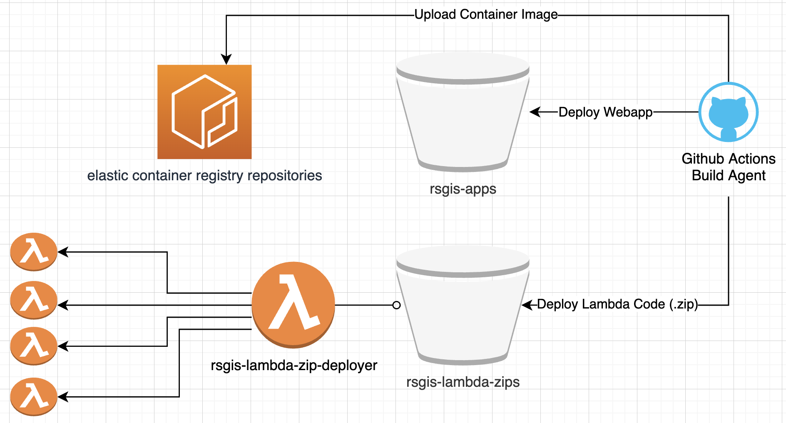

# RSGIS/CX Cloud Architecture

A starting place for documentation on Remote Sensing and GIS Center of Expertise (RSGIS/CX) application development and deployment strategies.

## Table of Contents

- [RSGIS/CX Cloud Architecture](#rsgiscx-cloud-architecture)
  - [Table of Contents](#table-of-contents)
  - [Continuous Integration and Deployment (CI/CD)](#continuous-integration-and-deployment-cicd)
    - [Components](#components)
    - [Configuring the AWS Cloud Environment](#configuring-the-aws-cloud-environment)
    - [Configuring Automated Builds (Github Actions)](#configuring-automated-builds-github-actions)

## Continuous Integration and Deployment (CI/CD)

Continuous Integration and Deployment means that as new code is commited to git-based source control, the code is automatically built and deployed to the environment where it is "live" for all to see.
Once configured, it typically takes less than 5 minutes from the time code is committed and the new site is "live".  Build agents are currently GitHub Actions.

The architecture described below supports the following deployment strategies:

1. AWS Lambda Function Code (.zip)
2. Docker Images
3. Static Websites (React.js, Angular, etc.)

### Components

The infrastructure that supports CI/CD is shown in the diagram below. Each piece is described in more detail in [Configuring AWS CloudEnvironment](#configuring-the-aws-cloud-environment)



### Configuring the AWS Cloud Environment

1. Create S3 Bucket **rsgis-apps**
   
   The purpose of this bucket is host web user interfaces (html/css/js files). Files are updated via continuous integration (CI)

2. Create S3 Bucket **rsgis-lambda-zips**
   
   The purpose of this bucket is host most up-to-date zips containing underlying lambda function code and layers. `ObjectCreated` operations in this bucket will automatically trigger updates to associated lambda functions using the function **rsgis-lambda-zip-deployer** .
   
3. Create Elastic Container Registry (ECR) Repositories

   Let's start with 2 new repositories. Additional repositories will be required as additional dockerized projects are added:
   
   1. instrumentation-dcs
   2. instrumentation-dcs-sidecar

4. Create a lambda function called **rsgis-lambda-zip-deployer**

   The purpose of this function is to update lambda function code based on `ObjectCreated` actions in S3 Bucket **rsgis-lambda-zips** .

   Configure the Lambda function to fire on `ObjectCreated` operations in bucket **rsgis-lambda-zips**
   
   The code for the lambda function is written in javascript and is tracked in source control. The function code is short enough that it it's copied below to give an idea of how it works:

   ```javascript
   var AWS = require('aws-sdk');
   var lambda = new AWS.Lambda();
   
   const zipMap = {
       "rsgis-instrumentation-api.zip": "rsgis-instrumentation-api",
       "rsgis-cumulus-api.zip": "rsgis-cumulus-api",
   }
   
   // Return lambda function name for a given zipfile name
   const functionName = (zipName) => zipMap[zipName]
   
   exports.handler = function(event, context) {
       const key = event.Records[0].s3.object.key
       const bucket = event.Records[0].s3.bucket.name
       console.log(`Create Event Detected in Bucket: ${bucket}; Key ${key}`)
   
       if (bucket == "rsgis-lambda-zips" && zipMap.hasOwnProperty(key)) {
           const fn = functionName(key);
           console.log(`Update Code for Lambda Function: ${fn}`);
           
           const params = {
               FunctionName: fn,
               S3Key: key,
               S3Bucket: bucket,
           };
           
           // Update function code
           lambda.updateFunctionCode(params, function(err, data) {
               if (err) {
                   console.log(`FAIL; Update Code for Lambda Function: ${fn}`);
                   console.log(err)
               } else {
                   console.log(`SUCCESS; Update Code for Lambda Function: ${fn}`);
               }
           });
       } else {
           context.succeed(`skipping zip ${key} in bucket ${bucket}`);
       }
   };
   ```
   
   The lambda function needs an associated **execution role** that allows the following permissions:

   1. Read .zip files uploaded to S3 Bucket rsgis-lambda-zips

       ```
      Actions:
         s3:GetObject
      Resource:
         rsgis-lambda-zips/*
       ```
     
   2. Update code associated with other Lambda functions:
      
      ```
      Actions:
          lambda:UpdateFunctionCode
      Resources:
         rsgis-lambda-zip-deployer
         <Lambda Function 1> (other lambda functions as necessary)
         <Lambda Function 2>
         <Lambda Function ... >
      ```
    
   3. AWSLambdaBasicExecutionRole (Basic role to allow creating/writing cloudwatch logs)


5. Create CI/CD User **rsgisci-user**

   User Does **not** need console access

   Create user API Token (AWS_ACCESS_KEY_ID, AWS_SECRET_ACCESS_KEY)

   Assign following user permissions, whether by inline policy or attached roles. These permissions allow upload to specific S3 buckets and ECR Repositories.

      1. Allow CI to upload newly built webapp content
        
         ```
         Actions:
            s3:PutObject
            s3:GetObject
            s3:DeleteObject
         Resources:
            rsgis-apps/*
         ```


      2. Allow CI to upload new .zip content for AWS Lambda Functions

         ```
         Actions:
            s3:PutObject
            s3:GetObject
            s3:DeleteObject
         Resources:
            rsgis-lambda-zips/*
         ```
    
      3. Allow CI to push docker images to Elastic Container Registry (ECR)

         ```
         Actions:
            ecr:GetDownloadUrlForLayer
            ecr:BatchGetImage
            ecr:CompleteLayerUpload
            ecr:UploadLayerPart
            ecr:InitiateLayerUpload
            ecr:BatchCheckLayerAvailability
            ecr:PutImage
 
         Resources:
            ECR Repository "instrumentation-dcs"
            ECR Repository "instrumentation-dcs-sidecar"
            <Repository 1> (other repositories as necessary)
            <Repository 2>
            <Repository ... >
         ```

### Configuring Automated Builds (Github Actions)

Build agents require a limited set of permissions to upload artifacts (compiled code, docker images, web content, etc) to the AWS environment after a build.  These permissions are provided via a AWS User Account Token associated with the **rsgisci-user**.

The user has limited priviliges to highly-specific resources in the environment to practice least privilege.

The token is shared with the build agent via encrypted [Repository Secrets or Organization Secrets](https://docs.github.com/en/actions/configuring-and-managing-workflows/creating-and-storing-encrypted-secrets). Specifically, the secrets that must be saved with Github below.

```
Note: These are the values associated with the rsgisci-user's TOKEN, not the values for the account.
AWS User Access Tokens can be disabled, deleted, rotated, etc. as necessary without deleting the user account.
```

1. AWS_ACCESS_KEY_ID
2. AWS_SECRET_ACCESS_KEY
3. AWS_DEAFULT_REGION

